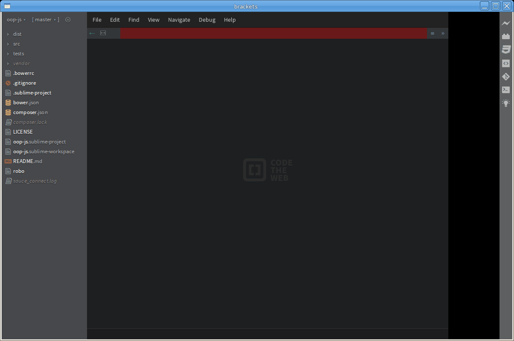

Git Projects for Brackets
================================================================================
Git Projects for Brackets is a package for the Brackets IDE,
which allows you to quickly list and open your local git repositories.

[](https://github.com/brad-jones/git-projects)

_This is a port of this plugin from Atom. https://atom.io/packages/git-projects_

> It was the one feature I missed when I went back to using Sublime after
> deciding that Atom was too slow / buggy. And now I am giving brackets a
> go and loving it.

Installation
--------------------------------------------------------------------------------
Search for "Git Projects" in the brackets
[Extension Manager](https://github.com/adobe/brackets/wiki/Brackets-Extensions),
then click on the Install button.

### On First Run

When Brackets reloads after installing the extension you will be prompted for
the **Base Path** of where we will scan for the local git repositories.

### Max Depth

By default we only search 2 levels, this makes sure Brackets doesn't hang
scanning your entire filesystem. You can change this value after installation
by editing your _"Preferences File"_.

Found @ ```Debug -> Open Preferences File```

Change the value of ```"git-projects.maxDepth"```

Usage
--------------------------------------------------------------------------------
Keyboard shortcut is set to: ```Alt-P```

__OR__

Open it via the menu: ```File -> Git Projects```

--------------------------------------------------------------------------------
Developed by Brad Jones - brad@bjc.id.au
